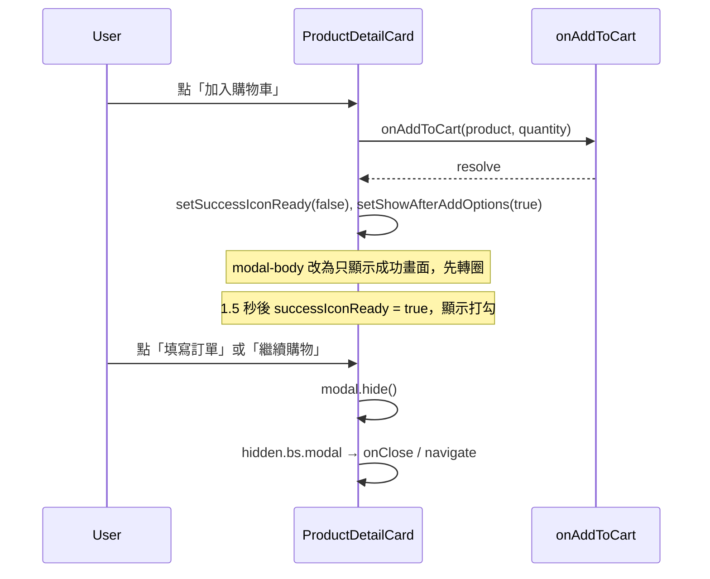

# 加入購物車成功訊息 UI 實作計畫

## 1. 目的

本文件記錄「**加入購物車成功訊息 UI 調整**」之實作計畫與要點：在產品明細 Modal 內，加入購物車成功後改為顯示完整成功畫面（含轉圈→打勾動畫、標題、說明、兩顆按鈕），供維護與擴充時參考。

## 2. 範圍

- **元件**：`components/common/ProductDetailCard.jsx`
- **流程**：點「加入購物車」→ API 成功 → 顯示成功畫面（動畫圖示、標題、說明、填寫訂單／繼續購物按鈕）→ 使用者選擇後關閉 Modal 或導向購物車。

## 3. 權責

| 模組 | 檔案 | 職責 |
|------|------|------|
| 產品明細與加入購物車 | `components/common/ProductDetailCard.jsx` | 產品明細 Modal、加入購物車、成功畫面（轉圈→打勾、標題、說明、按鈕）、關閉與導向 |
| 產品列表 | `pages/ProductList.jsx` | 傳入 `onAddToCart`、開啟 ProductDetailCard |

## 4. 名詞解釋

| 名詞 | 說明 |
|------|------|
| showAfterAddOptions | 是否顯示「加入購物車成功」後的選項區塊（成功畫面） |
| successIconReady | 成功畫面圖示階段：false = 轉圈圈，true = 打勾（約 1.5 秒後切換） |
| afterCloseNavigateToRef | 關閉 Modal 後要導向的路徑（填寫訂單時為 /Cart），在 hidden.bs.modal 時執行 |

## 5. 作業內容（實作要點）

### 5.1 現狀與目標差異

- **調整前**：成功後在產品明細右欄內顯示一行「加入購物車成功」、一行「請選擇：」與兩顆按鈕。
- **調整後**：成功後 `modal-body` 改為只顯示**獨立成功畫面**（大圖示動畫、標題、說明、兩顆按鈕），且圖示為「先轉圈圈、約 1.5 秒後打勾」。

### 5.2 成功畫面內容（對齊附圖）

1. **大綠色勾選圖示（動畫）**
   - **階段一（轉圈）**：圓形 spinner（Bootstrap `spinner-border text-success`），大尺寸（例如 80px）。
   - **階段二（打勾）**：約 1.5 秒後切換為打勾圖示（react-icons `FaCheckCircle`），綠色、同尺寸。
   - 實作：state `successIconReady` 預設 `false`；點「加入購物車」成功時先 `setSuccessIconReady(false)` 再 `setShowAfterAddOptions(true)`；`useEffect` 依賴 `showAfterAddOptions`，為 true 時啟動 1.5 秒 timer 將 `successIconReady` 設為 `true`，cleanup 清除 timer。

2. **標題**：「加入購物車成功」（粗體）。

3. **說明**：「商品已成功加入購物車」（`text-muted`）。

4. **按鈕**：左「填寫訂單」`btn-success`、右「繼續購物」`btn-secondary`；填寫訂單 → 設 `afterCloseNavigateToRef.current = "/Cart"` 後 `modal.hide()`；繼續購物 → 僅 `modal.hide()`。

### 5.3 其他調整

- **Modal 標題**：成功畫面時改為「加入購物車」。
- **Modal 頁尾**：成功畫面時不顯示「關閉」按鈕（`!showAfterAddOptions` 才渲染 modal-footer）。
- **開 Modal 時重置**：`useEffect`（依賴 selectedProduct）內重置 `showAfterAddOptions`、`successIconReady`，確保每次開啟都是產品明細且動畫從轉圈開始。

### 5.4 流程摘要

## 6. 參考文件

- [Bootstrap 5 Spinner](https://getbootstrap.com/docs/5.3/components/spinners/)
- 專案內：`1.docs/購物流程與API說明.md`（購物車與結帳流程）
- 專案內：`components/common/ProductDetailCard.jsx`（實際實作）

## 7. 驗證方式

| 項目 | 預期結果 |
|------|----------|
| 加入購物車成功後 | 先看到轉圈（約 1.5 秒），再變為打勾；標題、說明與兩顆按鈕；無產品明細內容 |
| 點「填寫訂單」 | Modal 關閉並跳轉至 `/Cart` |
| 點「繼續購物」 | Modal 關閉，停留在當前頁（產品列表） |
| 再次開啟產品明細並加入購物車 | 成功畫面再次從轉圈開始，再變為打勾 |
