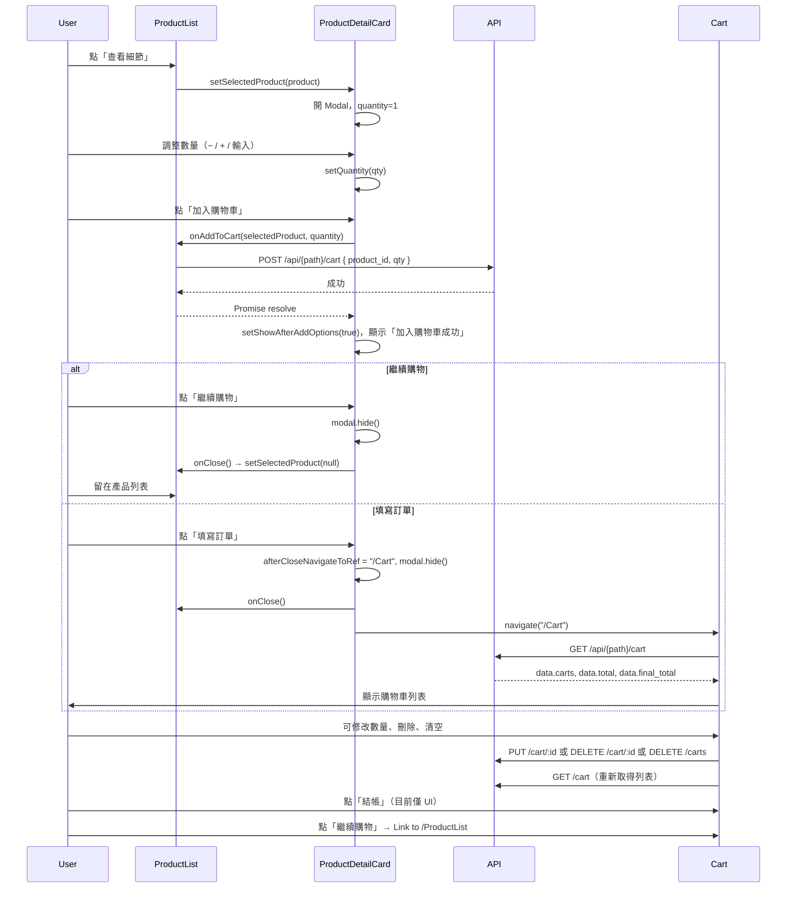

# 購物流程架構與資料流說明

## 1. 目的

本文件說明前台購物流程：從**產品列表**進入**產品明細**、設定**購物數量**、**加入購物車**，至**購物車列表**與**結帳**的整體架構、資料流，以及所使用之 API 行為。

## 2. 範圍

- 產品列表頁（ProductList）
- 產品明細 Modal（ProductDetailCard）
- 加入購物車流程（API + 繼續購物／填寫訂單）
- 購物車列表頁（Cart）
- 結帳按鈕（目前為 UI，未接後端）

## 3. 權責

| 模組 | 檔案 | 職責 |
|------|------|------|
| 產品列表 | `pages/ProductList.jsx` | 取得產品列表、分頁；開啟產品明細；呼叫加入購物車 API |
| 產品明細 | `components/common/ProductDetailCard.jsx` | 顯示產品資訊、數量選擇、加入購物車、繼續購物／填寫訂單 |
| 購物車列表 | `pages/Cart.jsx` | 取得／更新／刪除購物車；顯示總計；繼續購物、結帳入口 |
| 路由 | `routes/index.jsx` | `/ProductList`、`/Cart` 路徑與元件對應 |

## 4. 名詞解釋

| 名詞 | 說明 |
|------|------|
| VITE_API_BASE / VITE_API_PATH | 環境變數（.env），API 主機與路徑前綴 |
| product_id | 產品唯一識別，加入／更新購物車時傳給後端 |
| cartId | 購物車項目 id（後端回傳），用於更新數量、刪除單筆 |
| qty | 數量（number） |

## 5. 架構與資料流

### 5.1 頁面與元件關係

```
Layout (Outlet)
├── /ProductList  → ProductList
│                    ├── 產品卡片列表（products, pagination）
│                    └── ProductDetailCard(selectedProduct, onClose, onAddToCart)
│                         └── Modal：產品詳情、數量、加入購物車、繼續購物／填寫訂單
└── /Cart         → Cart
                     └── 購物車表格（carts, total, final_total）、清空、結帳、繼續購物
```

### 5.2 購物流程（使用者操作與資料流）



### 5.3 資料流摘要

| 階段 | 資料來源 | 資料去向 | 說明 |
|------|----------|----------|------|
| 產品列表 | GET products API | ProductList state (products, pagination) | 掛載時與分頁時取得 |
| 開啟明細 | ProductList.products | ProductDetailCard (selectedProduct) | 由 products.find 取得單一 product |
| 數量 | ProductDetailCard 本機 state (quantity) | 與 selectedProduct 一併傳給 onAddToCart | 開 Modal 時重置為 1 |
| 加入購物車 | product.id + quantity | POST cart API | 後端寫入購物車，前端無本機 cart state |
| 購物車列表 | GET cart API | Cart state (cartData.carts, total, final_total) | 掛載時與每次異動後 getCart() |
| 更新／刪除 | 使用者操作 | PUT/DELETE cart API → 再 GET cart | 購物車資料以 API 為唯一來源 |

## 6. 使用到的 API 行為

環境變數：`VITE_API_BASE`、`VITE_API_PATH`（來自 `.env`）。

### 6.1 取得產品列表

| 項目 | 說明 |
|------|------|
| **用途** | 產品列表頁列表與分頁 |
| **Method** | GET |
| **Path** | `{VITE_API_BASE}/api/{VITE_API_PATH}/products?page={page}` |
| **呼叫時機** | ProductList 掛載（page=1）、使用者切換分頁 |
| **Request** | 無 body，query: `page`（數字） |
| **Response** | `{ products: [...], pagination: {...} }` |
| **前端處理** | 設定 `products`、`pagination` state |

### 6.2 加入購物車

| 項目 | 說明 |
|------|------|
| **用途** | 將指定產品與數量加入後端購物車 |
| **Method** | POST |
| **Path** | `{VITE_API_BASE}/api/{VITE_API_PATH}/cart` |
| **呼叫時機** | 產品明細 Modal 內點「加入購物車」 |
| **Request Body** | `{ data: { product_id: string, qty: number } }` |
| **Response** | 依後端規格（前端僅判斷成功／失敗） |
| **前端處理** | 成功後 ProductDetailCard 顯示「加入購物車成功」與「繼續購物／填寫訂單」 |

### 6.3 取得購物車列表

| 項目 | 說明 |
|------|------|
| **用途** | 購物車頁顯示目前購物車內容與總計 |
| **Method** | GET |
| **Path** | `{VITE_API_BASE}/api/{VITE_API_PATH}/cart` |
| **呼叫時機** | Cart 頁掛載、每次更新／刪除／清空後 |
| **Request** | 無 body |
| **Response** | `{ data: { carts: [...], total: number, final_total: number } }`；carts 每筆含 id、product_id、product、qty、total 等 |
| **前端處理** | 設定 `cartData`（carts, total, final_total），用於表格與總計 |

### 6.4 更新購物車項目數量

| 項目 | 說明 |
|------|------|
| **用途** | 修改購物車中某一項的數量 |
| **Method** | PUT |
| **Path** | `{VITE_API_BASE}/api/{VITE_API_PATH}/cart/{cartId}` |
| **呼叫時機** | Cart 頁使用者修改數量（− / + / 輸入） |
| **Request Body** | `{ data: { product_id: string, qty: number } }` |
| **Response** | 依後端規格 |
| **前端處理** | 成功後呼叫 getCart() 重新取得列表 |

### 6.5 刪除單筆購物車項目

| 項目 | 說明 |
|------|------|
| **用途** | 從購物車移除一筆項目 |
| **Method** | DELETE |
| **Path** | `{VITE_API_BASE}/api/{VITE_API_PATH}/cart/{id}` |
| **呼叫時機** | Cart 頁使用者點該筆的刪除鈕 |
| **Request** | 無 body，id 為路徑參數（購物車項目 id） |
| **前端處理** | 成功後呼叫 getCart() |

### 6.6 清空購物車

| 項目 | 說明 |
|------|------|
| **用途** | 清空整台購物車 |
| **Method** | DELETE |
| **Path** | `{VITE_API_BASE}/api/{VITE_API_PATH}/carts` |
| **呼叫時機** | Cart 頁使用者點「清空購物車」 |
| **Request** | 無 body |
| **前端處理** | 成功後呼叫 getCart() |

## 7. 結帳

- 購物車頁提供「結帳」按鈕，目前僅為 UI，未接後端或下一頁流程。
- 若未來要接訂單 API，可在此按鈕的 onClick 中呼叫建立訂單 API，並依需求導向訂單確認頁或完成頁。

## 8. 參考文件

- 助教第五堂 PDF：購物車功能（POST/GET/PUT/DELETE cart API）
- 專案路由：`routes/index.jsx`
- 環境變數：`.env`（VITE_API_BASE, VITE_API_PATH）
- 專案內：`1.docs/響應式佈局說明-漢堡選單與填寫訂單.md`（漢堡選單與填寫訂單表單之響應式佈局）
- 專案內：`1.docs/加入購物車成功訊息UI實作計畫.md`（加入購物車成功畫面與轉圈→打勾動畫之實作計畫）
- 專案內：`1.docs/結帳與填寫訂單區塊切換實作說明.md`（結帳／取消結帳按鈕與填寫訂單區塊顯示／隱藏、收合時清空表單）

## 9. 相關檔案清單

| 檔案 | 說明 |
|------|------|
| `pages/ProductList.jsx` | 產品列表、getProducts、addCart、openModal、ProductDetailCard |
| `components/common/ProductDetailCard.jsx` | 產品明細 Modal、數量、加入購物車、成功畫面（轉圈→打勾）、繼續購物／填寫訂單 |
| `pages/Cart.jsx` | 購物車列表、getCart、updateCart、deleteCart、deleteCartAll、結帳／填寫訂單區塊切換、填寫訂單表單區 |
| `pages/Layout.jsx` | 版面、導覽列（漢堡選單）、主內容區寬度 |
| `routes/index.jsx` | /ProductList、/Cart 路由 |
| `.env` | VITE_API_BASE、VITE_API_PATH |
| `1.docs/響應式佈局說明-漢堡選單與填寫訂單.md` | 漢堡選單與填寫訂單區響應式佈局說明 |
| `1.docs/加入購物車成功訊息UI實作計畫.md` | 加入購物車成功訊息 UI 實作計畫 |
| `1.docs/結帳與填寫訂單區塊切換實作說明.md` | 結帳／取消結帳與填寫訂單區塊切換、收合時清空表單 |
